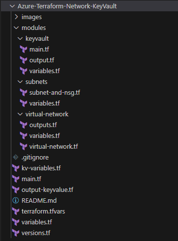

# Azure Multi-Tier Network Deployment & Managing Key Vault by Terraform

## Azure Virtual Network Definition and Concepts

Azure Virtual Network (VNet) is the core building block of a private network in Azure. The virtual network helps multiple types of Azure resources, like Azure Virtual Machines (VM), to securely communicate within the virtual network, the internet, and on-premises networks. It is equivalent to a traditional network in a data center, however, Azure infrastructure brings additional benefits like scalability, availability, and isolation.

The above figure shows a typical Azure Virtual Network. A Virtual Network is divided into smaller network components called Subnets. There are different types of Azure Cloud resources that can be deployed in these Subnets.

**VNET ADDRESS SPACE**: During the creation of VNet, we have to specify a custom private IP address space using RFC 1918 addresses. Microsoft azure assigns a private IP address to resources in a virtual network from the address space we assigned during it's creation. For example, if we deploy a virtual machine in a VNet with address space, 10.0.0.0/16, the virtual machine will be assigned a private IP like 10.0.0.7.

**SUBNETS**: Subnets helps to create smaller networks within the Azure virtual network. It segments the virtual network into one or more sub-networks, during the subnet creation process allocation of a portion of the virtual network's address space is facilitated to each subnet. We can deploy Azure resources to a specific subnet. Subnets allow us to segment our VNet address space into segments that are appropriate for the internal network. It improves address allocation efficiency.

**REGIONS**: Azure Virtual Network is scoped to a single geographic location. Virtual Network Peering enables connection between multiple virtual networks from different regions.

**NETWORK SECURITY GROUP**: We can use an Azure network security group to filter network traffic between Azure resources in an Azure virtual network. It contains security rules that allow or deny inbound network traffic to or outbound network traffic from several Azure resources. NSG can be assigned to Subnets to secure Azure resource workloads.

## Azure Virtual Network Functions

The above figure broadly describes different capabilities or functions of the Azure Virtual network.

**ISOLATION AND SEGMENTATION**: Deployment of VMs in VNet automatically isolates other resources. We can further use Subnets to segment the network and secure the resources by using network security groups.

**INTERNET COMMUNICATION**: All resources in VNet can automatically communicate outbound to the internet. We can use Public IP or load balancer for inbound communication.

**COMMUNICATION WITH RESOURCES**: Resources communicate securely using a virtual network or virtual network endpoints.

**ON-PREMISE COMMUNICATION**: Communication between on-premise resources can be enabled via Point-to-Site VPN, Site-to-Site VPN, and Express Route connection.

**NETWORK TRAFFIC FILTRATION**: Network traffic filtration is possible using Network Security Groups, Application Security Groups, Azure Firewall, or Network Virtual Appliance.

**NETWORK TRAFFIC ROUTING**: Route tables can be used to configure user-defined routes and propagate on-premise routes to virtual networks.

**NETWORK TRAFFIC MONITORING**: Network security group logs and traffic analytics monitoring solution enables traffic monitoring.

**NETWORK CONNECTIVITY**: Virtual network peering with cloud-based networks or any on-premise networks is possible irrespective of where the networks are located.

## Azure Key Vault Service

Azure Key Vault is one of Microsoft's most highly available cloud services. It can be used for securely storing and accessing secrets. Some examples of secrets are such as API keys, passwords, certificates, or cryptographic keys, these secrets we would always like to have tightened control while accessing. Vaults and managed hardware security module(HSM) pools are two different types of containers, currently supported by the Azure Key Vault service. Storing software and HSM-backed keys, secrets, and certificates are supported by Vaults. Managed HSM pools only support HSM-backed keys.

### Broad Applications of Azure Key Vault

**Secrets Management**: It secures the storing process and has tight control access to tokens, passwords, certificates, API keys, and other secrets.

**Key Management**: Makes it easy to create and control the encryption keys used to encrypt data

**Certificate Management**: Helps in management and deployment of public and private TLS/SSL certificates for use with the Azure and On-Premise connected resources

**Storing secrets backed by hardware security models (HSM)**: Secrets and keys can be protected either by Software or FIPS 140-2 level validated HSMs.

## What we are going to build?

We are going to build 4 tier network. We will deploy an Azure VNet with four different Subnets with specific network security groups. These NSGs will have inbound rules for specific network ports. Above figure shows the deployed 4-tier network.

We will use terraform to configure the whole deployment.

### Code Structure

Code is segregated into three modules and the main section. Module virtual networks (**modules/virtual-network**) and subnets (**modules/subnets**) implement the actual VNet and it's components, and **modules\keyvault** contains the Azure Key Vault module. main.tf code contains resource group implementation and calls three modules to implement the entire network and key vault service. 

